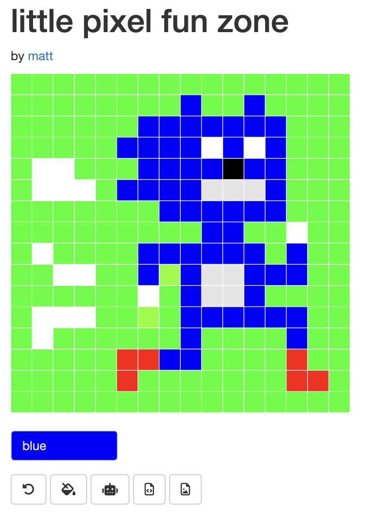

# little-pixel-fun-zone

<!-- badges: start -->

<!-- badges: end -->

A small [pixel-editor toy for the browser]([https://matt-dray.github.io/little-pixel-fun-zone/](https://connect.posit.cloud/matt-dray/content/01929f88-4e28-a552-bc1f-62fa999e2c63)). Click the squares on/off to draw a little picture.

Built with [{shiny}](https://shiny.posit.co/). Recycles code from [{pixeltrix}](https://github.com/matt-dray/pixeltrix), an interactive pixel-editor for the R graphics window.

Intended for learning purposes. Read more in [the accompanying blog post](https://www.rostrum.blog/posts/2024-09-15-shiny-pixel/). May never be 'finished'.

